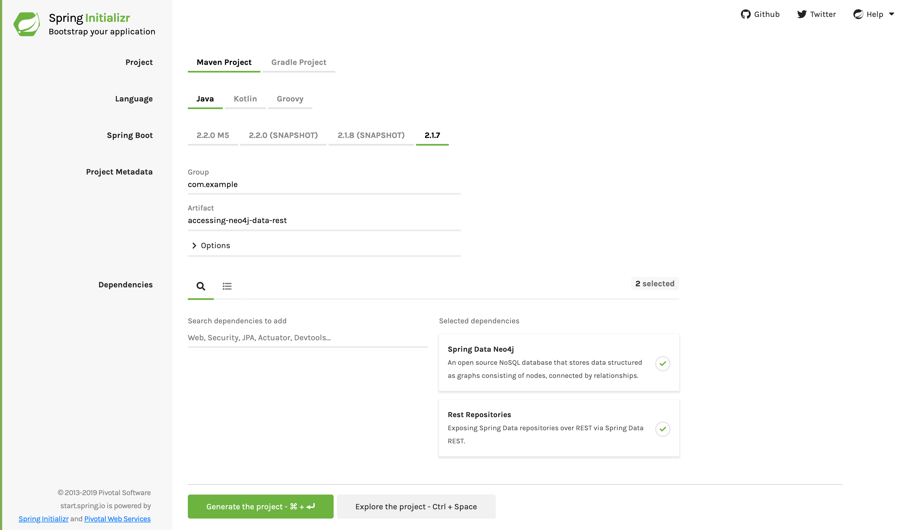

:spring_version: current
:spring_data_rest: current
:spring_data_commons: current
:spring_boot_version: 2.2.2.RELEASE
:Component: https://docs.spring.io/spring/docs/{spring_version}/javadoc-api/org/springframework/stereotype/Component.html
:Controller: https://docs.spring.io/spring/docs/{spring_version}/javadoc-api/org/springframework/stereotype/Controller.html
:DispatcherServlet: https://docs.spring.io/spring/docs/{spring_version}/javadoc-api/org/springframework/web/servlet/DispatcherServlet.html
:SpringApplication: https://docs.spring.io/spring-boot/docs/{spring_boot_version}/api/org/springframework/boot/SpringApplication.html
:ResponseBody: https://docs.spring.io/spring/docs/{spring_version}/javadoc-api/org/springframework/web/bind/annotation/ResponseBody.html
:EnableAutoConfiguration: https://docs.spring.io/spring-boot/docs/{spring_boot_version}/api/org/springframework/boot/autoconfigure/EnableAutoConfiguration.html
:toc:
:icons: font
:source-highlighter: prettify
:project_id: gs-accessing-neo4j-data-rest

This guide walks you through the process of creating an application that accesses
graph-based data through a link:/guides/gs/rest-hateoas[hypermedia-based] RESTful front
end.

== What You Will Build

You will build a Spring application that lets you create and retrieve `Person` objects
that are stored in a https://www.neo4j.org/[Neo4j] NoSQL database by using Spring Data
REST. Spring Data REST takes the features of
https://projects.spring.io/spring-hateoas[Spring HATEOAS] and
https://projects.spring.io/spring-data-neo4j[Spring Data Neo4j] and automatically combines
them together.

NOTE: Spring Data REST also supports link:/guides/gs/accessing-data-rest[Spring Data JPA],
link:/guides/gs/accessing-gemfire-data-rest[Spring Data Gemfire], and
link:/guides/gs/accessing-mongodb-data-rest[Spring Data MongoDB] as backend data stores,
but this guide deals with Neo4j.

== What You Need

:java_version: 1.8
include::https://raw.githubusercontent.com/spring-guides/getting-started-macros/master/prereq_editor_jdk_buildtools.adoc[]

include::https://raw.githubusercontent.com/spring-guides/getting-started-macros/master/how_to_complete_this_guide.adoc[]

== Standing up a Neo4j Server

Before you can build a this application, you need to set up a Neo4j server.

Neo4j has an open source server that you can install for free.

On a Mac with Homebrew installed, you can type the following in a terminal window:

====
----
$ brew install neo4j
----
====

For other options, see https://neo4j.com/download/community-edition/

Once you have installed Neo4j, you can launch it with its default settings by running the
following command:

====
----
$ neo4j start
----
====

You should see a message similar to the following:

====
----
Starting Neo4j.
Started neo4j (pid 96416). By default, it is available at http://localhost:7474/
There may be a short delay until the server is ready.
See /usr/local/Cellar/neo4j/3.0.6/libexec/logs/neo4j.log for current status.
----
====

By default, Neo4j has a username and password of `neo4j` and `neo4j`. However, it requires
that the new account password be changed. To do so, run the following command:

====
----
$ curl -v -u neo4j:neo4j -X POST localhost:7474/user/neo4j/password -H "Content-type:application/json" -d "{\"password\":\"secret\"}"
----
====

This changes the password from `neo4j` to `secret` (something to NOT DO in production!)
With that completed, you should be ready to run this guide.

== Starting with Spring Initializr

For all Spring applications, you should start with the https://start.spring.io[Spring
Initializr]. The Initializr offers a fast way to pull in all the dependencies you need for
an application and does a lot of the set up for you. This example needs the Rest
Repositories and Spring Data Neo4j dependencies. The following image shows the
Initializr set up for this sample project:

You can follow this https://start.spring.io/#!type=maven-project&language=java&platformVersion=2.1.9.RELEASE&packaging=jar&jvmVersion=1.8&groupId=com.example&artifactId=accessing-neo4j-data-rest&name=accessing-neo4j-data-rest&description=Demo%20project%20for%20Spring%20Boot&packageName=com.example.accessing-neo4j-data-rest&dependencies=data-neo4j,data-rest[link] to create the project skeleton.

NOTE: The preceding image shows the Initializr with Maven chosen as the build tool. You
can also use Gradle. It also shows values of `com.example` and
`accessing-neo4j-data-rest` as the Group and Artifact, respectively. You will use those
values throughout the rest of this sample.

The following listing shows the `pom.xml` file created when you choose Maven:

====
[src,xml]
----
include::complete/pom.xml[]
----
====

The following listing shows the `build.gradle` file created when you choose Gradle:

====
[src,groovy]
----
include::complete/build.gradle[]
----
====

[[initial]]
== Permissions to Access Neo4j

Neo4j Community Edition requires credentials to access it. You can configure the
credentials by setting properties in `src/main/resources/application.properties`, as
follows:

====
[source]
----
include::complete/src/main/resources/application.properties[]
----
====

This includes the default username (`neo4j`) and the newly set password (`secret`) that
you set earlier.

WARNING: Do NOT store real credentials in your source repository. Instead, configure them
in your runtime by using
https://docs.spring.io/spring-boot/docs/current/reference/htmlsingle/#boot-features-external-config[Spring Boot's property overrides].

== Create a Domain Object

You need to create a new domain object to present a person, as the following example (in
`src/main/java/com/example/accessingneo4jdatarest/Person.java`) shows:

====
[source,java,tabsize=2]
----
include::complete/src/main/java/com/example/accessingneo4jdatarest/Person.java[]
----
====

The `Person` object has a first name and a last name. There is also an ID object that is
configured to be automatically generated so that you need not do so.

== Create a `Person` Repository

Next, you need to create a simple repository, as the following example (in
`src/main/java/com/example/accessingneo4jdatarest/PersonRepository.java`) shows:

====
[source,java,tabsize=2]
----
include::complete/src/main/java/com/example/accessingneo4jdatarest/PersonRepository.java[]
----
====

This repository is an interface and lets you perform various operations that involve
`Person` objects. It gets these operations by extending the
https://docs.spring.io/spring-data/commons/docs/{spring_data_commons}/api/org/springframework/data/repository/PagingAndSortingRepository.html[`PagingAndSortingRepositry`]
interface defined in Spring Data Commons.

At runtime, Spring Data REST automatically creates an implementation of this interface.
Then it uses the https://docs.spring.io/spring-data/rest/docs/{spring_data_rest}/api/org/springframework/data/rest/core/annotation/RepositoryRestResource.html[`@RepositoryRestResource`]
annotation to direct Spring MVC to create RESTful endpoints at `/people`.

NOTE: `@RepositoryRestResource` is not required for a repository to be exported. It is
used only to change the export details, such as using `/people` instead of the default
value of `/persons`.

Here you have also defined a custom query to retrieve a list of `Person` objects based on
the `lastName` value. You can see how to invoke it later in this guide.

== Finding the Application Class

The Spring Initializr creates an application class when you use it to create a project.
You can find that in
`src/main/java/com/example/accessingneo4jdatarest/Application.java`. Note that
the Spring Initializr concatenates (and properly changes the case of) the package name and
adds it to `Application` to create the application case name. In this case, we get
`AccessingNeo4jDataRestApplication`, as the following listing shows:

====
[source,java,tabsize=2]
----
include::complete/src/main/java/com/example/accessingneo4jdatarest/AccessingNeo4jDataRestApplication.java[]
----
====

You need not make any changes to this application class for this example

include::https://raw.githubusercontent.com/spring-guides/getting-started-macros/master/spring-boot-application-new-path.adoc[]

The `@EnableNeo4jRepositories` annotation activates Spring Data Neo4j. Spring Data Neo4j
creates a concrete implementation of the `PersonRepository` and configures it to talk to
an embedded Neo4j database by using the Cypher query language.

include::https://raw.githubusercontent.com/spring-guides/getting-started-macros/master/build_an_executable_jar_subhead.adoc[]

include::https://raw.githubusercontent.com/spring-guides/getting-started-macros/master/build_an_executable_jar_with_both.adoc[]

Logging output is displayed. The service should be up and running within a few seconds.

== Test the Application

Now that the application is running, you can test it. You can use any REST client you
wish. The following examples use the *nix tool called `curl`.

First, you want to see the top level service. The following example (with output) shows
how to do so:

====
[source,data]
----
$ curl http://localhost:8080
{
  "_links" : {
    "people" : {
      "href" : "http://localhost:8080/people{?page,size,sort}",
      "templated" : true
    }
  }
}
----
====

Here you get a first glimpse of what this server has to offer. There is a `people` link
located at http://localhost:8080/people. It has some options such as `?page`, `?size`, and
`?sort`.

NOTE: Spring Data REST uses the http://stateless.co/hal_specification.html[HAL format] for
JSON output. It is flexible and offers a convenient way to supply links adjacent to the
data that is served.

====
[source,data]
----
$ curl http://localhost:8080/people
{
  "_links" : {
    "self" : {
      "href" : "http://localhost:8080/people{?page,size,sort}",
      "templated" : true
    },
    "search" : {
      "href" : "http://localhost:8080/people/search"
    }
  },
  "page" : {
    "size" : 20,
    "totalElements" : 0,
    "totalPages" : 0,
    "number" : 0
  }
}
----
====

There are currently no elements and, consequently, no pages, so it is time to create a new
`Person`! To do so, run the following command (shown with its output):

====
[source,data]
----
$ curl -i -X POST -H "Content-Type:application/json" -d '{  "firstName" : "Frodo",  "lastName" : "Baggins" }' http://localhost:8080/people
HTTP/1.1 201 Created
Server: Apache-Coyote/1.1
Location: http://localhost:8080/people/0
Content-Length: 0
Date: Wed, 26 Feb 2014 20:26:55 GMT
----

- `-i` ensures you can see the response message including the headers. The URI of the newly created `Person` is shown
- `-X POST` signals this a `POST` used to create a new entry
- `-H "Content-Type:application/json"` sets the content type so the application knows the payload contains a JSON object
- `-d '{  "firstName" : "Frodo",  "lastName" : "Baggins" }'` is the data being sent
====

NOTE: Notice how the previous `POST` operation includes a `Location` header. This contains the URI of the newly created resource. Spring Data REST also has two methods (`RepositoryRestConfiguration.setReturnBodyOnCreate(…)` and `setReturnBodyOnCreate(…)`) that you can use to configure the framework to immediately return the representation of the resource that was just created.

From this you can query for all people by running the following command (shown with its
output):

====
[source,data]
----
$ curl http://localhost:8080/people
{
  "_links" : {
    "self" : {
      "href" : "http://localhost:8080/people{?page,size,sort}",
      "templated" : true
    },
    "search" : {
      "href" : "http://localhost:8080/people/search"
    }
  },
  "_embedded" : {
    "people" : [ {
      "firstName" : "Frodo",
      "lastName" : "Baggins",
      "_links" : {
        "self" : {
          "href" : "http://localhost:8080/people/0"
        }
      }
    } ]
  },
  "page" : {
    "size" : 20,
    "totalElements" : 1,
    "totalPages" : 1,
    "number" : 0
  }
}
----
====

The `people` object contains a list with Frodo. Notice how it includes a `self` link.
Spring Data REST also uses the
https://www.atteo.org/2011/12/12/Evo-Inflector.html[Evo Inflector] library to pluralize the
name of the entity for groupings.

You can query directly for the individual record by running the following command (shown
with its output):

====
[source,data]
----
$ curl http://localhost:8080/people/0
{
  "firstName" : "Frodo",
  "lastName" : "Baggins",
  "_links" : {
    "self" : {
      "href" : "http://localhost:8080/people/0"
    }
  }
}
----
====

NOTE: This might appear to be purely web based, but, behind the scenes, there is an
embedded Neo4j graph database. In production, you would probably connect to a standalone
Neo4j server.

In this guide, there is only one domain object. With a more complex system, where domain
objects are related to each other, Spring Data REST renders additional links to help
navigate to connected records.

You can find all the custom queries by running the following command (shown with its
  output):

====
[source,data]
----
$ curl http://localhost:8080/people/search
{
  "_links" : {
    "findByLastName" : {
      "href" : "http://localhost:8080/people/search/findByLastName{?name}",
      "templated" : true
    }
  }
}
----
====

You can see the URL for the query, including the HTTP query parameter: `name`. Note that
this matches the `@Param("name")` annotation embedded in the interface.

To use the `findByLastName` query, run the following command (shown with its output):

====
[source,data]
----
$ curl http://localhost:8080/people/search/findByLastName?name=Baggins
{
  "_embedded" : {
    "people" : [ {
      "firstName" : "Frodo",
      "lastName" : "Baggins",
      "_links" : {
        "self" : {
          "href" : "http://localhost:8080/people/0"
        },
        "person" : {
          "href" : "http://localhost:8080/people/0"
        }
      }
    } ]
  },
  "_links" : {
    "self" : {
      "href" : "http://localhost:8080/people/search/findByLastName?name=Baggins"
    }
  }
}
----
====

Because you defined it to return `List<Person>` in the code, it returns all of the
results. If you had defined it to return only `Person`, it would pick one of the `Person`
objects to return. Since this can be unpredictable, you probably do not want to do that
for queries that can return multiple entries.

You can also issue `PUT`, `PATCH`, and `DELETE` REST calls to either replace, update, or
delete existing records. The following example (shown with its output) shows a `PUT` call:

====
[source,data]
----
$ curl -X PUT -H "Content-Type:application/json" -d '{ "firstName": "Bilbo", "lastName": "Baggins" }' http://localhost:8080/people/0
$ curl http://localhost:8080/people/0
{
  "firstName" : "Bilbo",
  "lastName" : "Baggins",
  "_links" : {
    "self" : {
      "href" : "http://localhost:8080/people/0"
    }
  }
}
----
====

The following example (shown with its output) shows a `PATCH` call:

====
[source,data]
----
$ curl -X PATCH -H "Content-Type:application/json" -d '{ "firstName": "Bilbo Jr." }' http://localhost:8080/people/0
$ curl http://localhost:8080/people/0
{
  "firstName" : "Bilbo Jr.",
  "lastName" : "Baggins",
  "_links" : {
    "self" : {
      "href" : "http://localhost:8080/people/0"
    }
  }
}
----
====

NOTE: `PUT` replaces an entire record. Fields that are not supplied are replaced with
`null`. `PATCH` can be used to update a subset of items.

You can also delete records, as the following example (shown with its output) shows:

====
[source,data]
----
$ curl -X DELETE http://localhost:8080/people/0
$ curl http://localhost:8080/people
{
  "_links" : {
    "self" : {
      "href" : "http://localhost:8080/people{?page,size,sort}",
      "templated" : true
    },
    "search" : {
      "href" : "http://localhost:8080/people/search"
    }
  },
  "page" : {
    "size" : 20,
    "totalElements" : 0,
    "totalPages" : 0,
    "number" : 0
  }
}
----
====

A convenient aspect of this hypermedia-driven interface is how you can discover all the
RESTful endpoints by using curl (or whatever REST client you like). You need not exchange
a formal contract or interface document with your customers.

== Summary

Congratulations! You have just developed an application with a
link:/guides/gs/rest-hateoas[hypermedia-based] RESTful front end and a Neo4j-based back
end.

== See Also

The following guides may also be helpful:

* https://spring.io/guides/gs/accessing-data-rest/[Accessing JPA Data with REST]
* https://spring.io/guides/gs/accessing-mongodb-data-rest/[Accessing MongoDB Data with REST]
* https://spring.io/guides/gs/accessing-data-mysql/[Accessing data with MySQL]
* https://spring.io/guides/gs/accessing-gemfire-data-rest/[Accessing Gemfire Data with REST]
* https://spring.io/guides/gs/consuming-rest/[Consuming a RESTful Web Service]
* https://spring.io/guides/gs/consuming-rest-angularjs/[Consuming a RESTful Web Service with AngularJS]
* https://spring.io/guides/gs/consuming-rest-jquery/[Consuming a RESTful Web Service with jQuery]
* https://spring.io/guides/gs/consuming-rest-restjs/[Consuming a RESTful Web Service with rest.js]
* https://spring.io/guides/gs/securing-web/[Securing a Web Application]
* https://spring.io/guides/tutorials/bookmarks/[Building REST services with Spring]
* https://spring.io/guides/gs/spring-boot/[Building an Application with Spring Boot]
* https://spring.io/guides/gs/testing-restdocs/[Creating API Documentation with Restdocs]
* https://spring.io/guides/gs/rest-service-cors/[Enabling Cross Origin Requests for a RESTful Web Service]
* https://spring.io/guides/gs/rest-hateoas/[Building a Hypermedia-Driven RESTful Web Service]

include::https://raw.githubusercontent.com/spring-guides/getting-started-macros/master/footer.adoc[]
